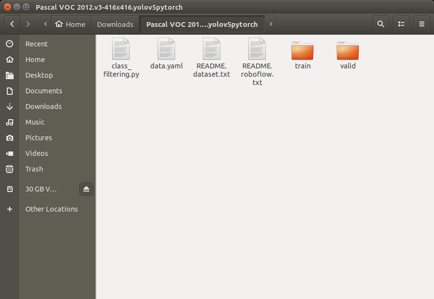

# Yolov5-PascalVOC2012-Dataset-Filtering
Pascal VOC 2012 Dataset filtering with yolov5 format

---

# How to prepare my own dataset for YOLOv5
First just follow up [this scripts](https://github.com/ultralytics/yolov5/wiki/Train-Custom-Data#1-create-dataset) for download dataset to train. It's [Pascal VOC 2012 dataset](https://universe.roboflow.com/jacob-solawetz/pascal-voc-2012/3) that we want to use.


Now you have dataset file tree like this. And what we interested in is data.yaml and train/valid folder.

```bash
Pascal_VOC_2012
            |___data.yaml
            |___README.dataset.txt
            |___README.roboflow.txt
            |___train
            |    |___images
            |    |   |___img1
            |    |   |___img2
            |    |       .
            |    |       .
            |    |       .
            |    |___labels
            |        |___label1
            |        |___label2
            |            .
            |            .
            |            .
            |___valid
                |___images
                |   |___img1
                |   |___img2
                |       .
                |       .
                |       .
                |___labels
                |   |___label1
                |   |___label2
                |       .
                |       .
                |       .
```

# How to filtering

1. Locate [class_filtering.py](class_filtering.py) to your dataset floder.



2. Run the script.

```bash
$ python3 class_filterting.py
```

Choose classes that you want to detect. Classes are seperated with spacebar input. And press enter, now it's over. Only classes you choosed are left in your dataset.


# Edit data.yaml

Finally you have to edit data.yaml. For example, I want to detect only cat & dog. So I edited my data.yaml like this. **nc** means number of class, in my case it becomes 2. And you also be careful about your dataset path configure.

```yaml
path: ../datasets/Pascal_VOC_2012_cat_dog  # dataset root dir
train: train/images  # train images (relative to 'path')
val: valid/images    # validation images (relative to 'path')

nc: 2
names: ['cat', 'dog']
```


